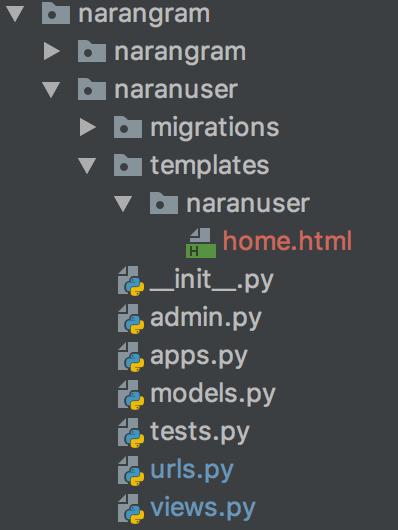

# Templates

Una plantilla es simplemente un archivo de texto. Puede generar cualquier formato basado en texto (HTML, XML, CSV...)

Una plantilla contiene variables, que se sustituyen por valores cuando se evalúa la plantilla, y tags, que controlan la
 lógica de la plantilla.

A continuación se muestra una plantilla mínima que ilustra algunos aspectos básicos. Cada elemento se explicará más 
adelante en este documento.

```djangotemplate


{{ section.title }}


<h1>{{ section.title }}</h1>


<h2>
  <a href="{{ story.get_absolute_url }}">
    {{ story.headline|upper }}
  </a>
</h2>
<p>{{ story.tease|truncatewords:"100" }}</p>


```

Para utilizar una plantilla lo primero es crearla, y para ello debemos hacerlo siguiendo una lógica. 
Lo primero es crear un directorio **templates** en nuestra app, que dentro debe contener otro 
directorio con el mismo nombre que la app, en nuestro caso **naranuser**.

Tenemos que hacerlo así porque Django funciona mezclando los directorios templates de las apps, de manera que al 
final él tiene un solo directorio templates y dentro otro para cada app.

Dentro de este subdirectorio **templates/narangram** de la app vamos a comenzar creando un fichero **home.html**:



Vamos a realizar una primera versión (en crudo, sin estilos) de lo que sería nuestra home en html:

```html
<!DOCTYPE html>
<html lang="en">
<head>
    <meta charset="UTF-8">
    <title>Narangram Home</title>
</head>
<body>
<h1>Mi Web Personal</h1>

<ul>
    <li><a href="/naranuser/">Portada</a></li>
    <li><a href="/login/">Login</a></li>
    <li><a href="/signup/">Signup</a></li>
</ul>

<h2>Bienvenidos</h2>

<p>Esto es la portada de Narangram</p>
</body>
</html>

```

Lo que nos interesa es cambiar nuestra vista para que en lugar de devolver la respuesta HttpResponse devuelva este 
template HTML, y para ello vamos utilizar el método render del módulo http de Django, que ya viene incluido por defecto.

Vamos al fichero **views.py** y realizemos un refactor de nuestra vista hello_world para adaptarla al proyecto:

```python
def home(request):
    return render(request, "narangram/home.html")
    
```

Además tenemos que cambiar el nombre de la función en **urls.py** de nuestra aplicación:

```python
from django.urls import path

from . import views

urlpatterns = [
    path('', views.home, name='home'),
]

```

Una vez hecho vamos a probar si carga la portada, pero como podréis observar no funcionará ya que por defecto Django 
optimiza el uso de la memoria así que no carga las plantillas de una app que no esté instalada en 
settings.py. Para cargar la app core y sus plantillas en memoria debemos ir al fichero **narangram/settings.py** y 
añadir la app en la lista **INSTALLED_APPS** justo abajo del todo:

```python
INSTALLED_APPS = [
    'django.contrib.admin',
    'django.contrib.auth',
    'django.contrib.contenttypes',
    'django.contrib.sessions',
    'django.contrib.messages',
    'django.contrib.staticfiles',
    'naranuser.apps.NaranuserConfig',
]
```

Ahora probamos de nuevo y... FUNCIONA! pero vamos a darle algo de estilo a nuestro html, añadamos 
[bootstrap](https://getbootstrap.com/docs/4.2/getting-started/download/). Vamos a introducir además el header y 
el footer de la web.

```html
<!DOCTYPE html>
<html lang="en">
<head>
    <meta charset="UTF-8">
    <title>Narangram Home</title>
    <link rel="stylesheet" href="https://stackpath.bootstrapcdn.com/bootstrap/4.2.1/css/bootstrap.min.css" integrity="sha384-GJzZqFGwb1QTTN6wy59ffF1BuGJpLSa9DkKMp0DgiMDm4iYMj70gZWKYbI706tWS" crossorigin="anonymous">
    <script src="https://stackpath.bootstrapcdn.com/bootstrap/4.2.1/js/bootstrap.min.js" integrity="sha384-B0UglyR+jN6CkvvICOB2joaf5I4l3gm9GU6Hc1og6Ls7i6U/mkkaduKaBhlAXv9k" crossorigin="anonymous"></script>
</head>
<body>

<header>
  <div class="d-flex flex-column flex-md-row align-items-center p-3 px-md-4 mb-3 bg-white border-bottom shadow-sm">
  <h5 class="my-0 mr-md-auto font-weight-normal">Narangram</h5>
  <nav class="my-2 my-md-0 mr-md-3">
    <a class="p-2 text-dark" href="/naranuser/">Portada</a>
  </nav>
  <a class="btn btn-outline-primary" href="#">Sign up</a>
</div>
</header>
<main role="main">

  <section class="jumbotron text-center">
    <div class="container">
      <h1 class="jumbotron-heading">Narangram HOME</h1>
      <p class="lead text-muted">
          Esta es la Home de Narangram
      </p>
    </div>
  </section>

</main>
<footer class="text-muted">
  <div class="container">
    <p class="float-right">
      <a href="#">Back to top</a>
    </p>
    <p>Este es el footer</p>
  </div>
</footer>
</body>
</html>
```

## Variables
```djangotemplate


{{ section.title }}


<h1>{{ section.title }}</h1>


<h2>
  <a href="{{ story.get_absolute_url }}">
    {{ story.headline|upper }}
  </a>
</h2>
<p>{{ story.tease|truncatewords:"100" }}</p>


```
Las variables se ven así: `{{ variable }}`. 

Cuando el motor de plantillas encuentra una variable, evalúa esa variable y la reemplaza con el resultado. 
Los nombres de variables pueden estar formados por cualquier combinación de caracteres alfanuméricos y
el guión bajo ("_"), pero no pueden comenzar con un guión bajo. El punto (".") también aparece en las variables, 
aunque tiene un significado especial, como se veremos a continuación. Es importante destacar que no puede tener 
espacios o caracteres de puntuación en los nombres de las variables.

Utilice un punto (.) para acceder a los atributos de una variable.

En el ejemplo anterior, `{{ section.title }}}` será reemplazado por el atributo title del objeto section.

Si utiliza una variable que no existe, el sistema de plantillas insertará el valor de la opción `string_if_invalid`, 
que por defecto es '' (la cadena vacía).

Tenga en cuenta que "bar" en una expresión de plantilla como `{{ foo.bar }}` se interpretará como una cadena literal y 
no utilizando el valor de la variable "bar", si existe en el contexto de la plantilla.

Los atributos de las variables que empiezan con un guión bajo no pueden ser accedidos ya que generalmente se 
consideran privados.

## Filtros

Podemos modificar las variables para su visualización mediante el uso de filtros.

Los filtros se ven así: `{{ name|lower }}`. Esto muestra el valor de la variable `{{ name }}` después de ser filtrada,
el filtro convierte el texto a minúsculas. Utilice una tubería (|) para aplicar un filtro.

Los filtros pueden ser "encadenados". La salida de un filtro se aplica al siguiente. `{{ text|escape|linebreaks }}}` es 
un lenguaje común para escapar contenidos de texto, y luego convertir saltos de línea a etiquetas <p>.

Algunos filtros aceptan argumentos. Un argumento de filtro tiene el siguiente aspecto: `{{ bio|truncatewords:30 }}`. 
Esto mostrará las primeras 30 palabras de la variable bio.

Los argumentos de filtro que contienen espacios deben ser citados; por ejemplo, para unir una lista con comas y espacios
 se debe usar `{{ list|join:", " }}`.

Django proporciona unos [sesenta filtros](https://docs.djangoproject.com/en/2.1/ref/templates/builtins/#ref-templates-builtins-filters) 
de plantilla incorporados. Aquí están algunos de los filtros de plantillas más utilizados:

###default
Si una variable es falsa o está vacía, utilice la opción predeterminada. De lo contrario, utilice el valor de la variable. 

`{{ value|default:"nothing" }}`

Si value no se pasa o está vacío, en el html se mostrará "nothing".

###length
Devuelve la longitud del valor. Esto funciona tanto para cadenas como para listas.

`{{ value|length" }}`

Si value es `['a', 'b', 'c', 'd']`, la salida será 4.


###filesizeformat
Formatea el valor como un tamaño de archivo "legible para humanos" (es decir,'13 KB', '4,1 MB', '102 bytes', etc.).

`{{ value|filesizeformat }}`

Si value es 123456789, la salida será 117.7 MB.

## Tags
Las template tags se ven así: ``. **Las template tags son más complejas que las variables:** Algunos crean texto 
en la salida, otros controlan el flujo realizando bucles o lógica, y otros cargan información externa en la plantilla 
para ser utilizada por variables posteriores.

Algunas template tags requieren etiquetas iniciales y finales 
(es decir, ` .... contenido de la etiqueta... `).

Django viene de serie con muchos template tags incorporadas. Estas son algunas de las template tags más usados:

###for
Bucle sobre cada elemento de una lista. Por ejemplo, para mostrar una lista de atletas proporcionada en athlete_list:

```djangotemplate
<ul>

    <li>{{ athlete.name }}</li>

</ul>
```

###if, elif, and else

Evaluates a variable, and if that variable is «true» the contents of the block are displayed:
Condicionales. Evalúa una variable, y si esa variable es "true" se muestra el contenido del bloque:


```djangotemplate

    Number of athletes: {{ athlete_list|length }}

    Athletes should be out of the locker room soon!

    No athletes.

```


## Herencia de plantillas

Si ahora quisiéramos crear una nueva url para dar información sobre la web, imagina que la llamamos "about", 
¿cómo lo haríamos?...

Iríamos al fichero **views.py** y crearíamos un nuevo método **about**:

```python
def about(request):
    return render(request, "narangram/about.html")
    
```

Además tenemos que añadir esta nueva view en **urls.py** de nuestra aplicación:

```python
from django.urls import path

from . import views

urlpatterns = [
    path('', views.about, name='about'),
]

```

¿Y el html? ¿qué hacemos con el html?, quiero que antes de responder pienses en una frase:

> En programación, si estás repitiendo código, es que lo estás haciendo mal.

Vale imagina que hacemos "el camino fácil", copiamos el anterior html y añadimos lo que queremos en nuestra nueva vista:

```html
<!DOCTYPE html>
<html lang="en">
<head>
    <meta charset="UTF-8">
    <title>Narangram Home</title>
    <link rel="stylesheet" href="https://stackpath.bootstrapcdn.com/bootstrap/4.2.1/css/bootstrap.min.css" integrity="sha384-GJzZqFGwb1QTTN6wy59ffF1BuGJpLSa9DkKMp0DgiMDm4iYMj70gZWKYbI706tWS" crossorigin="anonymous">
    <script src="https://stackpath.bootstrapcdn.com/bootstrap/4.2.1/js/bootstrap.min.js" integrity="sha384-B0UglyR+jN6CkvvICOB2joaf5I4l3gm9GU6Hc1og6Ls7i6U/mkkaduKaBhlAXv9k" crossorigin="anonymous"></script>
</head>
<body>

<header>
  <div class="d-flex flex-column flex-md-row align-items-center p-3 px-md-4 mb-3 bg-white border-bottom shadow-sm">
  <h5 class="my-0 mr-md-auto font-weight-normal">Narangram</h5>
  <nav class="my-2 my-md-0 mr-md-3">
    <a class="p-2 text-dark" href="/naranuser/">Portada</a>
  </nav>
  <a class="btn btn-outline-primary" href="#">Sign up</a>
</div>
</header>
<main role="main">

  <section class="jumbotron text-center">
    <div class="container">
      <h1 class="jumbotron-heading">Narangram About</h1>
      <p class="lead text-muted">
          Esta es la sección About de Narangram
      </p>
    </div>
  </section>

</main>
<footer class="text-muted">
  <div class="container">
    <p class="float-right">
      <a href="#">Back to top</a>
    </p>
    <p>Este es el footer</p>
  </div>
</footer>
</body>
</html>
```

Si nos fijamos, el header y el footer será el mismo en las dos vistas. 
Ahora imaginad que queremos cambiar el menú y añadir una nueva sección. ¿Qué problema tendríamos? Pues que deberíamos 
ir una a una cambiando exactamente lo mismo. ¿Es eso ideal? Para nada, más bien es un lastre, y por eso Django nos 
proporciona un sistema muy potente de herencia para nuestras plantillas.

Empezemos de 0, vamos a crear una plantilla base, y en esta ocasión vamos a hacerlo bien. Creamos el fichero base.html 
dentro de templates/naranuser.

```djangotemplate
<!DOCTYPE html>
<html lang="en">
<head>
    <meta charset="UTF-8">
    <title>Narangram Home</title>
    <link rel="stylesheet" href="https://stackpath.bootstrapcdn.com/bootstrap/4.2.1/css/bootstrap.min.css" integrity="sha384-GJzZqFGwb1QTTN6wy59ffF1BuGJpLSa9DkKMp0DgiMDm4iYMj70gZWKYbI706tWS" crossorigin="anonymous">
    <script src="https://stackpath.bootstrapcdn.com/bootstrap/4.2.1/js/bootstrap.min.js" integrity="sha384-B0UglyR+jN6CkvvICOB2joaf5I4l3gm9GU6Hc1og6Ls7i6U/mkkaduKaBhlAXv9k" crossorigin="anonymous"></script>
</head>
<body>

<header>
  <div class="d-flex flex-column flex-md-row align-items-center p-3 px-md-4 mb-3 bg-white border-bottom shadow-sm">
  <h5 class="my-0 mr-md-auto font-weight-normal">Narangram</h5>
  <nav class="my-2 my-md-0 mr-md-3">
    <a class="p-2 text-dark" href="/naranuser/">Portada</a>
  </nav>
  <a class="btn btn-outline-primary" href="#">Sign up</a>
</div>
</header>
<main role="main">

    

</main>
<footer class="text-muted">
  <div class="container">
    <p class="float-right">
      <a href="#">Back to top</a>
    </p>
    <p>Este es el footer</p>
  </div>
</footer>
</body>
</html>
```

Podemos ver como hemos añadido la parte repetitiva (header y footer) y hemos añadido una linea 
`` que es un **template tag** y sirve para añadir lógica de programación dentro del 
propio HTML. Existen muchos template tags en Django, iremos descubriendo algunos de ellos sobre la marcha.

En este caso el template tag **block** sirve para definir un bloque de contenido con un nombre.

Ahora viene la magia, vamos de vuelta por ejemplo a nuestro template home.html y vamos a dejar únicamente la parte de 
código específica de esa plantilla:

```djangotemplate



<section class="jumbotron text-center">
    <div class="container">
        <h1 class="jumbotron-heading">Narangram About</h1>
        <p class="lead text-muted">
            Esta es la sección About de Narangram
        </p>
    </div>
</section>


```

Podemos ver como hemos utilizado el template tag `extends` para indicarle a la plantilla **home.html** que herede el 
contenido de **base.html** y como hemos marcado con el template tag `block` el contenido que es propio de la sección
home.

## Ejercicio

1. Adapta el código en **base.html**, **home.html** para que el **title** de la página sea propio de cada sección.

2. Crea una nueva url en narangram que sea '/bienvenida/' y que muestre en el h1 un mensaje de bienvenida al usuario
usando su username que le vendrá dado a la plantilla html a través de la view. 